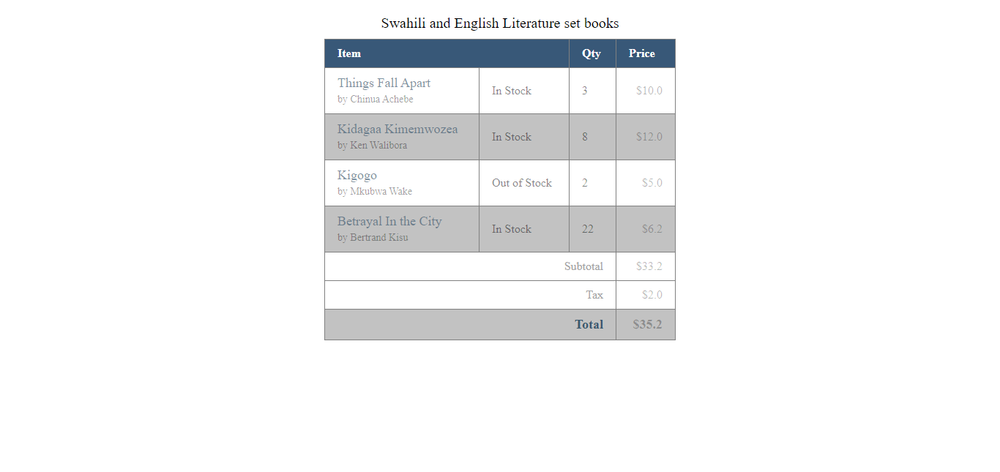

# HTML & CSS : Tables practice

I worked on creating tables and created a table with borders around it.

I created a table of items with their details that has borders around it and around the cells. The cells in the tbody have been striped with different colors.

## Built with

-HTML
-CSS

## Live Demo

[Tables](https://garang96.github.io/tables/)

## Authors

**John Alier Garang**

- Github: [@garang96](https://github.com/garang96)

